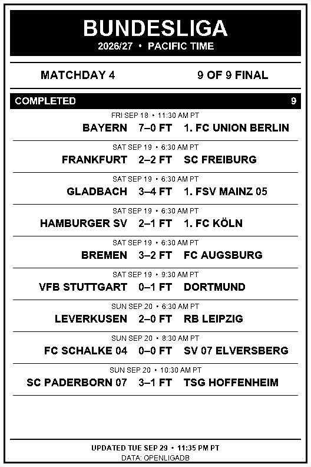

# X3 Bundesliga Dashboard

An automatically updated, newspaper-style Bundesliga scoreboard for the
528 × 792 pixel XTEINK X3 e-reader and CrossPoint Reader. This is the Bundesliga
edition of the [X3 Premier League dashboard](https://github.com/abasily1-byte/x3-premier-league),
with the same monochrome layout and sleep-screen workflow.

[Download the latest Bundesliga.bmp](https://raw.githubusercontent.com/abasily1-byte/x3-bundesliga/main/Bundesliga.bmp)



## How the pieces work together

- **GitHub** fetches the latest Bundesliga fixtures and results from OpenLigaDB
  and generates `Bundesliga.bmp` automatically.
- **Tasker** on an Android phone can download it as `Download/sleep.bmp` and
  send it to the X3.
- **CrossPoint Reader** runs the X3's File Transfer web server and uses the
  uploaded `/sleep.bmp` as the custom sleep screen.

GitHub publishes `Bundesliga.bmp`; the phone simply saves its downloaded copy
as `sleep.bmp`. You do not need to rename the GitHub output.

## What it shows

- Current Bundesliga season and matchday (Spieltag)
- Number of final matches out of all fixtures in that matchday
- Completed matches with final scores and `FT`
- Upcoming / not-yet-final fixtures, sorted by kickoff
- Kickoff and update times in `America/Los_Angeles` (Pacific Time)

The output is exactly **528 × 792**, an **uncompressed 24-bit RGB BMP**, with
only pure black and pure white pixels. The preview has exactly the same pixels.
Dates are converted from UTC with daylight saving time handled automatically.

Only matches that OpenLigaDB marks finished count as final. Non-final matches
remain in Upcoming; the app does not guess live status from the clock. Missing
kickoff times show `KICKOFF TBC`; an unavailable final score shows `?` rather
than inventing a result. Empty sections are omitted when all nine matches are
upcoming or all nine are final.

## Use the BMP directly

1. Download [Bundesliga.bmp](https://raw.githubusercontent.com/abasily1-byte/x3-bundesliga/main/Bundesliga.bmp).
2. Copy it to your X3's SD card and open it with CrossPoint Reader.
3. For a custom sleep screen, copy it to the root of the SD card as `sleep.bmp`
   and select the **Custom sleep-screen** option in CrossPoint Reader.

Stable download URL:

```text
https://raw.githubusercontent.com/abasily1-byte/x3-bundesliga/main/Bundesliga.bmp
```

Use the BMP on the X3; the PNG is provided for convenient viewing on GitHub.

## Data source

[OpenLigaDB](https://www.openligadb.de/) is a community-maintained data source.
League shortcut: `bl1` (German first Bundesliga). No API key, subscription, or
GitHub secret is required.

The generator uses three endpoints:

- `https://api.openligadb.de/getcurrentgroup/bl1` — the current matchday.
- `https://api.openligadb.de/getmatchdata/bl1` — the current fixtures and their
  season metadata, so the season is not hard-coded.
- `https://api.openligadb.de/getmatchdata/bl1/<season>/<matchday>` — all fixtures
  for that specific season and matchday.

OpenLigaDB advances its current matchday at the midpoint between the last
fixture of the previous matchday and the first fixture of the next one. During
a break, a fully completed matchday can therefore remain current for a while.
The dashboard follows this source-defined current matchday.

Final scores are selected by `resultTypeID=2`, never by array position or the
halftime score. The generator verifies league, season, matchday, and duplicate
IDs before rendering. It retries temporary network failures and fails visibly
if the source is unavailable; it does not stamp stale data with a fresh time.

[OpenLigaDB API documentation](https://github.com/OpenLigaDB/OpenLigaDB-Samples)

## Automatic updates

The [GitHub Actions workflow](.github/workflows/update.yml):

- requests updates at **minutes 7 and 37 of every hour, UTC**;
- can also be started manually from **Actions → Update Bundesliga dashboard →
  Run workflow** on `main`;
- runs when generator, dependencies, tests, or workflow code changes on `main`;
- prevents concurrent runs on the same branch;
- tests parsing/layout and validates the image before committing; and
- commits the BMP and PNG only when their generated bytes change.

This uses the same staggered off-peak schedule as the Premier League edition.
GitHub can delay or drop scheduled events, so exact update times are not
guaranteed. The footer shows when the image was actually generated. RAW GitHub
downloads may take a few minutes to reflect a new commit due to caching.

## Automatic X3 sleep-screen updates

### 1. Prepare CrossPoint Reader

On the X3:

1. Place or use `sleep.bmp` in the root of the SD card.
2. Select the **Custom sleep-screen** option in CrossPoint Reader.
3. Open **File Transfer → Join Network** when you want to refresh it.

Replace `<X3-IP>` below with the numeric address displayed on that screen.
Keep your Android phone and X3 on the same local network. The address can
change; reserving it in your router's DHCP settings makes repeated use easier.

### 2. Create the Tasker task

Add these three **HTTP Request** actions in order.

#### Action 1 — Download the latest dashboard

- **Method:** `GET`
- **URL:**

  ```text
  https://raw.githubusercontent.com/abasily1-byte/x3-bundesliga/main/Bundesliga.bmp
  ```

- **File To Save With Output:**

  ```text
  Download/sleep.bmp
  ```

#### Action 2 — Delete the old sleep screen from the X3

- **Method:** `POST`
- **URL:**

  ```text
  http://<X3-IP>/delete
  ```

- **Body:**

  ```text
  path=/sleep.bmp
  ```

#### Action 3 — Upload the new sleep screen

- **Method:** `POST`
- **URL:**

  ```text
  http://<X3-IP>/upload?path=/
  ```

- **Body:**

  ```text
  x=1
  ```

- **File To Send:**

  ```text
  file:Download/sleep.bmp
  ```

### 3. Refresh the sleep screen

1. On the X3, open **File Transfer → Join Network**.
2. Run the Tasker task.
3. Wait a few seconds for the delete and upload actions to finish.
4. Exit File Transfer.
5. Put the X3 to sleep.

The updated Bundesliga dashboard should appear. Because Tasker replaces the
same root file, you should not need to re-select the custom image each time.
If you use several league dashboards, whichever task ran last supplies the
current `sleep.bmp`.

### Android `.local` hostname note

`http://crosspoint.local` works on some phones, but Android can fail to resolve
the `.local` hostname. If Tasker reports:

```text
UnknownHostException: Unable to resolve host "crosspoint.local"
```

use the numeric IP address shown on the X3 instead.

## Optional NFC shortcut

1. In Tasker, open **Profiles → + → Event → Net → NFC Tag**.
2. Scan an ordinary NFC tag with your phone.
3. Associate the profile with your Bundesliga update task.

The workflow becomes:

**X3 → File Transfer → Join Network → tap phone on NFC tag → wait a few seconds
→ exit File Transfer → sleep**

The phone scans the NFC tag; the X3 receives the image over Wi-Fi.

## Run locally or adapt it

Python 3.10 or newer is recommended. Pillow is the only Python dependency.
Use a system font such as DejaVu Sans Condensed (used by the Linux workflow)
or Arial; the generator checks that names fit before drawing them.

```bash
python -m pip install -r requirements.txt
python -m unittest -v
python generate_bundesliga_bmp.py --validate
```

Validate existing artifacts without fetching data:

```bash
python generate_bundesliga_bmp.py --validate-only
```

The generator logs every displayed match, score, kickoff, and update timestamp
for source cross-checking. The repository is public: clone, fork, or adapt it.
For a fork, replace the owner in the RAW URL and ensure Actions has permission
to write repository contents. A fork's scheduled workflows may need to be
enabled manually in its Actions tab.
